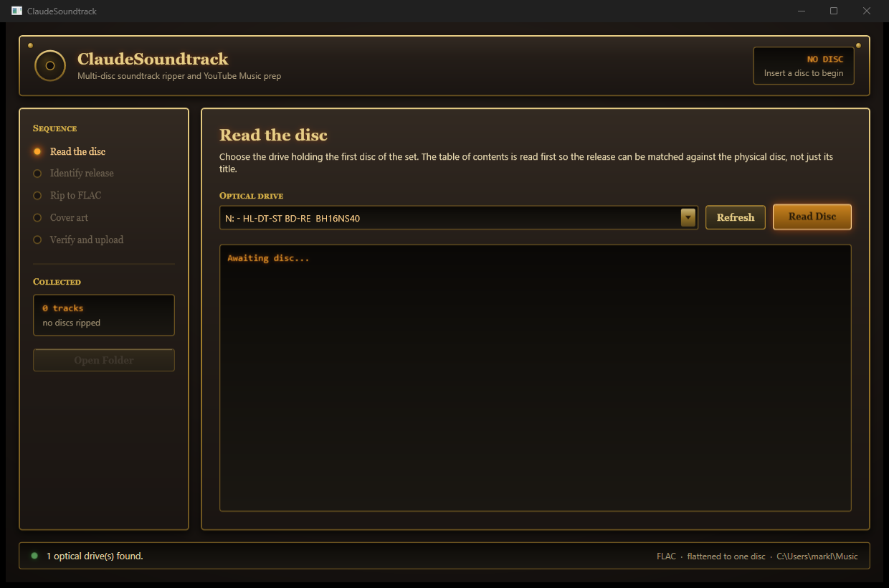

# ClaudeSoundtrack

[](https://github.com/Midcon113/ClaudeSoundtrack/actions/workflows/build.yml)

A Windows 11 app for ripping multi-disc movie soundtracks to FLAC and preparing them for upload to YouTube Music.

Expanded and complete-score releases are the awkward case. They arrive as two, three or four discs, they are limited pressings that metadata services barely cover, and YouTube Music has no concept of a disc within an album — so uploading them naively produces a jumbled mess with three "track 1"s and no cover. ClaudeSoundtrack handles that specific job end to end.



## What it does

- **Rips CD audio to FLAC** with drive read-offset correction, re-reads on damaged sectors, and AccurateRip checksums. Audio goes straight from the disc into the encoder — no intermediate WAV.
- **Flattens a multi-disc set into one album.** Three discs of ten tracks become tracks 1–30, all tagged as disc 1 of 1. This is what makes YouTube Music treat the set as a single album.
- **Leaves track numbers out of file names.** `01 - Main Titles.flac` becomes `Main Titles.flac`; the number lives in the `TRACKNUMBER` tag where it belongs. Titles that legitimately begin with a number — *2001: A Space Odyssey*, *633 Squadron* — are left alone.
- **Identifies the release and verifies it against the disc.** A MusicBrainz disc-ID hit is an exact fingerprint of the pressing. Discogs covers the limited runs MusicBrainz lacks, but every Discogs match is checked against the disc's own table of contents before it is trusted — otherwise a search for an expanded edition happily returns the original album of the same name.
- **Hunts for high-resolution cover art** across iTunes, the Cover Art Archive and Discogs, and always asks you to confirm before writing it. If nothing found is right, save the cover yourself and pick the file.
- **Verifies the album before you upload.** Every file is re-read from disk and checked for the things YouTube Music actually needs. If it passes, the album folder opens ready for dragging. If it does not, a track-by-track tag editor opens instead.

Finished albums land in `C:\Users\<you>\Music\<Artist> - <Album> (<Year>)\`.

## Download

Grab `ClaudeSoundtrack.exe` from the [latest release](https://github.com/Midcon113/ClaudeSoundtrack/releases/latest). It is a single self-contained file — no installer, no .NET runtime to install, no DLLs to keep beside it. Put it anywhere and run it.

## Requirements

- Windows 11 (Windows 10 20H1 or later also works)
- A CD/DVD/Blu-ray drive that can read audio CDs

Nothing else. The [.NET 10 SDK](https://dotnet.microsoft.com/download/dotnet/10.0) is only needed if you want to build it yourself.

## Building

```bash
dotnet build
```

```bash
dotnet test
```

```bash
dotnet run --project src/ClaudeSoundtrack.App
```

There are no local path dependencies — everything comes from NuGet, so a fresh clone builds.

To produce the standalone single-file executable yourself:

```powershell
.\build\publish.ps1
```

It lands in `artifacts\standalone\win-x64\`. Pass `-Runtime win-arm64` for Snapdragon machines. Trimming is deliberately disabled — ATL and the FLAC encoder both resolve types by reflection, and a trimmed build fails at runtime the first time it reads a tag.

## How it is put together

| Project | What it holds |
| --- | --- |
| `src/ClaudeSoundtrack.Core` | Ripping, metadata lookup, artwork search, tagging, flattening, naming, verification. No UI dependencies. |
| `src/ClaudeSoundtrack.App` | WPF interface, dialogs, and the steampunk theme. |
| `tests/ClaudeSoundtrack.Core.Tests` | Unit tests for the naming and flattening rules, plus an end-to-end pipeline test that encodes real FLAC files, tags them and verifies them from disk. |

Built on:

- **[FoxRedbook](https://www.nuget.org/packages/FoxRedbook)** — CD-DA drive access, table of contents, offset correction, AccurateRip
- **[CUETools.Codecs.Flake](https://www.nuget.org/packages/CUETools.Codecs.Flake)** — managed FLAC encoder
- **[ATL.NET](https://www.nuget.org/packages/z440.atl.core)** — Vorbis comment tagging and embedded artwork

## Notes on the design

A few decisions are worth knowing about before changing anything:

**Metadata matches are verified against the disc, not trusted.** Track count from the physical table of contents is compared against each candidate release. This is the check that distinguishes an expanded edition from the original album — the failure mode that makes soundtrack lookups unreliable without it.

**File names are sanitised, titles are not.** Soundtrack titles are full of characters Windows rejects; a colon in `Suite: Stingers And Act-Out Music` will kill a rip partway through. Only the file name is cleaned — the `TITLE` tag keeps the real punctuation.

**Dropping track numbers from file names reintroduces collisions.** Soundtracks repeat titles constantly, and a set can carry three tracks called `Source Music`. Names are deduplicated across the whole album, including against discs already ripped, so nothing is silently overwritten.

**The readiness check reads the files, not the app's own model.** The failure worth catching is the one where the app believes it wrote something it did not.

## Interface

The look is drawn from oxidised steel control panels with brass fittings and amber lamps. The convention is consistent and worth preserving: brass is structure, amber means active, green means done, and red is reserved for genuine faults.

## Licence

[MIT](LICENSE) — free to use, modify and redistribute, provided the copyright notice is kept.

Copyright © 2026 Mark Lam.
